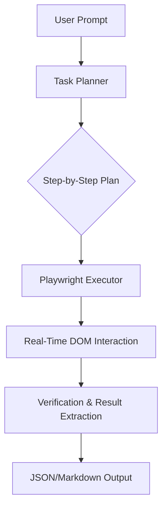

<p align="center">
  
</p>

<h1 align="center">
  
  <br/>
  Ghost-Agent: The Autonomous Browser Intelligence
</h1>

<p align="center">
  <strong>The open-source browser automation agent that thinks like a human and executes like a machine.</strong><br/>
  Zero-code. Natural Language. Production-ready.
</p>

<p align="center">
  <a href="https://github.com/rp0948566-hue/Ghost-Agent/stargazers"></a>
  <a href="https://github.com/rp0948566-hue/Ghost-Agent/network/members"></a>
  <a href="https://github.com/rp0948566-hue/Ghost-Agent/issues"></a>
  <a href="LICENSE"></a>
</p>

---

## 👻 Introduction

Ghost-Agent is not just another scraper. It is a **reasoning engine** for the web. Built on top of **Playwright** and powered by **GPT-4o**, Ghost-Agent interprets natural language instructions, navigates complex web architectures, and extracts or interacts with data just as a human would—but at the scale and speed of a bot.

> *"Go to the official OpenAI blog, find the last 3 articles about GPT-5, and summarize the key takeaways into a JSON file."*  
> **Ghost does the thinking. Ghost does the clicking. You get the results.**

---

## 💎 Key Features

- 🗣️ **Semantic Command Interface:** No more CSS selectors or XPath. Speak to your browser in English.
- 🧠 **Dynamic Planning:** The agent builds a step-by-step execution plan before it even opens the browser.
- ⚡ **High-Performance Execution:** Uses Playwright's core for ultra-fast, multi-browser support (Chromium, Firefox, WebKit).
- 📸 **Visual Verification:** Automated screenshotting at every lifecycle stage for debugging and audit logs.
- 🧩 **Extensible Task Registry:** Drop in custom Python functions to handle domain-specific automation.
- 🛡️ **Stealth Mode:** Built-in headers and behaviors to mimic organic human browsing patterns.

---

## 🛠️ Installation

### 1. Clone the Engine
```bash
git clone https://github.com/rp0948566-hue/Ghost-Agent.git
cd Ghost-Agent
```

### 2. Setup Environment
```bash
python -m venv .venv
source .venv/bin/activate  # Windows: .venv\Scripts\activate
pip install -r requirements.txt
playwright install chromium
```

### 3. Configuration
Rename `.env.example` to `.env` and add your OpenAI credentials:
```bash
OPENAI_API_KEY=your_key_here
```

---

## 🚀 Usage Examples

### One-Shot Research
```bash
ghost run "Research the top 5 trending tech stocks on Yahoo Finance and save the results"
```

### Stealth Mode (Visible Browser)
```bash
ghost run "Go to news.ycombinator.com and find stories about 'Automation'" --no-headless
```

### Interactive Command Center
Start a persistent session where the agent remembers the context of your previous clicks.
```bash
ghost interactive
```

---

## 🏗️ Architecture

Ghost-Agent operates on a **Tri-Layer Architecture**:

1.  **The Planner (LLM):** Breaks down your prompt into a deterministic sequence of browser actions.
2.  **The Executor (Playwright):** Translates the plan into machine-level browser events (clicks, scrolls, typing).
3.  **The Observer (Vision/OCR):** Scans the page state to ensure the plan is succeeding and adjusts in real-time.



---

## 🗺️ Roadmap (V1.0)

- [ ] **Multi-Agent Orchestration:** Run 10+ browser tasks in parallel.
- [ ] **Vision-First Navigation:** Use screenshots for element detection (GPTV support).
- [ ] **Self-Healing Selectors:** Automatically fix broken scripts when a website changes its UI.
- [ ] **Desktop Integration:** Automate Electron apps alongside the browser.

---

## 🤝 Contributing & Support

Ghost-Agent is an open-source project by **Rudra Pratap Singh**. We welcome contributions from the automation community.

- **Found a bug?** Open an [Issue](https://github.com/rp0948566-hue/Ghost-Agent/issues).
- **Want to add a feature?** Submit a [Pull Request](https://github.com/rp0948566-hue/Ghost-Agent/pulls).
- **Say Hi:** Connect with me on [LinkedIn](https://www.linkedin.com/in/rdrxyLFCex).

---

<p align="center">
  <strong>Don't forget to Star ⭐ the repo if you find it valuable!</strong>
</p>
